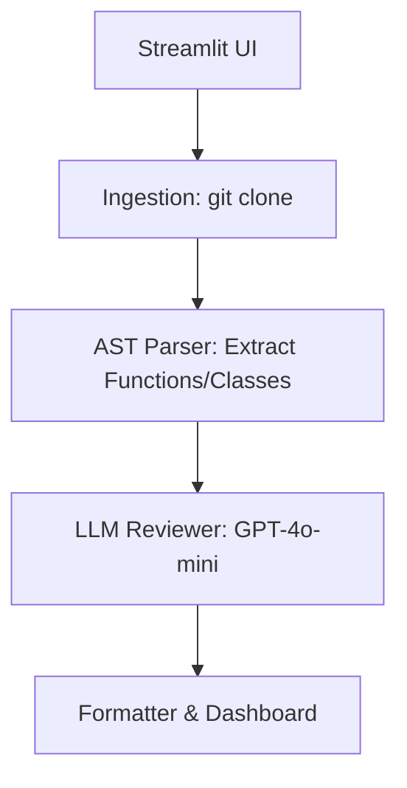

# AI Code Review Agent

An autonomous agent that clones a GitHub repository, parses source files using AST, sends code chunks to an LLM, and returns structured review comments with confidence scores — displayed in a Streamlit dashboard.

## Overview
This project uses Python's `ast` module to extract functions and classes from `.py` files and sends them to GPT-4o-mini for review.

## Setup Instructions
1. Clone this repository or download the source code.
2. Install the requirements:
   ```bash
   pip install -r requirements.txt
   ```
3. Set your OpenAI API key in the `.env` file:
   ```env
   OPENAI_API_KEY=your-api-key-here
   ```
4. Run the Streamlit application:
   ```bash
   streamlit run app.py
   ```

## Architecture


## Known Limitations
- The AST parser will skip files with syntax errors.
- Files over 500 lines are skipped.
- Only supports Python files.

## What I'd Build Next
- Support for Claude models via Anthropic API.
- Support for reviewing other languages (JS, TS, Java) using Tree-sitter.
- Add GitHub PR commenting integration.
- ## Architecture Diagram

```text
GitHub Repository URL
        ↓
Repository Cloning (GitPython)
        ↓
AST Parsing (Python ast)
        ↓
Code Chunk Extraction
        ↓
GPT-4o-mini Review Engine
        ↓
Confidence Score + Severity Rating
        ↓
Streamlit Dashboard Output
```

## Future Improvements

- Add support for Claude and Gemini models
- Add support for JavaScript, TypeScript and Java
- Add GitHub Pull Request inline comments
- Add review history and analytics dashboard
